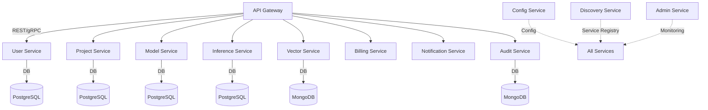

# BAAS-JAVA

[](https://github.com/prarabdha-soni/BAAS-JAVA/actions)
[](https://opensource.org/licenses/MIT)
[](https://github.com/prarabdha-soni/BAAS-JAVA/issues)
[](https://github.com/prarabdha-soni/BAAS-JAVA/stargazers)

## Overview

**BAAS-JAVA** is a cloud-native, enterprise-grade Backend-as-a-Service platform designed for AI startups and enterprises. It provides a robust microservices architecture to accelerate the development and deployment of AI-powered applications, offering essential backend capabilities out-of-the-box.

## Architecture

The platform is composed of modular Spring Boot microservices, each responsible for a core business or infrastructure function. This design enables scalability, maintainability, and rapid feature development.



### Core Services
- **admin-service**: Centralized monitoring and administration
- **config-service**: Centralized configuration management (Spring Cloud Config)
- **discovery-service**: Service registry and discovery (Eureka)
- **gateway-service**: API Gateway for routing and security
- **user-service**: User management and authentication
- **project-service**: Project/workspace management
- **model-service**: Model registration and management
- **inference-service**: AI inference endpoints and orchestration
- **vector-service**: Vector database integration for embeddings and search
- **billing-service**: Usage metering and billing
- **notification-service**: Email, SMS, and webhook notifications
- **audit-service**: Audit logging and compliance
- **common**: Shared code, DTOs, and security utilities
- **k8s/**: Kubernetes manifests for cloud deployment
- **scripts/**: DevOps and automation scripts

## Features
- Microservices-based, scalable architecture
- Centralized configuration and service discovery
- Secure user authentication and project isolation
- Model management and AI inference orchestration
- Vector search and database integration
- Monitoring, billing, and audit logging
- Ready for Docker Compose and Kubernetes deployment

## Example API Usage

### User Registration
```http
POST /api/users/register HTTP/1.1
Host: localhost:9001
Content-Type: application/json

{
  "username": "alice",
  "email": "alice@example.com",
  "password": "securepassword"
}
```

### Inference Request
```http
POST /api/inference/prompt HTTP/1.1
Host: localhost:9004
Content-Type: application/json

"What is the capital of France?"
```

### Dummy AI Model Prediction
```http
POST /api/model/predict HTTP/1.1
Host: localhost:9004
Content-Type: application/json

{
  "input": "hello world"
}
```
Response:
```json
{
  "prediction": "You sent: hello world. This is a dummy prediction."
}
```

## Getting Started

Each service is a Spring Boot microservice. To build all modules:

```sh
./mvnw clean install
```

### Run All Services (Development)

You can start all microservices in parallel using the provided script:

```sh
./scripts/run-all-services.sh
```

- This will build the project and start each service in the background.
- Logs for each service will be written to `<service>.log` files in the project root.

### Stop All Services

To stop all running Spring Boot microservices started by the above script:

```sh
./scripts/stop-all-services.sh
```

### Run with Docker Compose

To run the platform locally with Docker Compose:

```sh
docker-compose up --build
```

See each service's README for specific details and API documentation.

## Contributing

Contributions are welcome! Please fork the repository, create a feature branch, and submit a pull request.

## License

This project is licensed under the MIT License.
